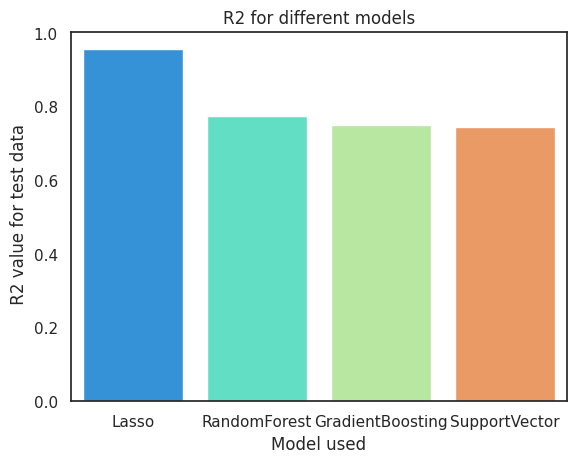

<b><h1>Walmart Sales Forecasting using Time-Series Analysis</h1></b>

<b>Supply Chain Management</b> is one of the biggest issues faced by Retail industry. The main focus is to balance the supply and demand in a manner that achieve the financial and service objectives of the enterprise.

If the store authorities get to know the demand of products that are sold in the store, it will be helpful for them to plan the supply chain accordingly. 

<b>One of the most crucial elements of strategic planning is predicting future sales for a company.</b>

In the kernal, I have analyzed in depth how internal and external factors of one of the biggest grocery chain WALMART can affect their Weekly Sales in future.

This module contains analysis of data, including time series analysis, recognizes the best performing stores, perform predictions on sales with help of linear regression models.

The data collected consists of sales data ranging from 2010 to 2012 for the 45 Walmart stores across US. Some external feature points like CPI, Unemployment rate and Fuel prices in the region of the store helped me to make a more detailed analysis.

## Data

The analysis is performed on 3 datasets:
1. <b>Store</b>: The data consists of store numbers ranging from 1 to 45.

2. <b>Type</b>: The data consists of three types of stores 'A', 'B' and 'C'.

3. <b>Size</b>: The data consists of the size of the store which is mainly determined by the number of products sold in the store.

## Sales Data

Various features in the dataset are as follows:
1. <b>Date</b>: The date of the week when the observations were noted
2. <b>Weekly_Sales</b>: The sales recorded that week
3. <b>Store</b>: The store number where the observation was recorded
4. <b>Dept</b>: A number from 1 to 99 that shows the department number
5. <b>IsHoliday</b>: A boolean value representing a holiday week or not
6. <b>Temperature</b>: The temperature of the region during the week
7. <b>Fuel_Price</b>: The fuel price in that region during the week
8. <b>MarkDown1:5</b>: It represents the type of markdown and the quantity of the product available that week
9. <b>CPI</b>: Customer Price Index during that week
10. <b>Unemployment</b>: The unemployment rate during that week in the region of the store

## Models used:

1. Lasso Regressor
2. Random Forest Regressor
3. Gradient Boosting Regressor
4. Support Vector Regressor
5. Time Series Analysis

After building multiple models to predict the weekly sales of 45 stores, we got the best accuracy of around 94% of accuracy for 3 months(90 Days).

Out of all the models, we select the Lasso Regressor as our predictive Model since due to it's highest prediction accuracy with the lowest residual(error)
